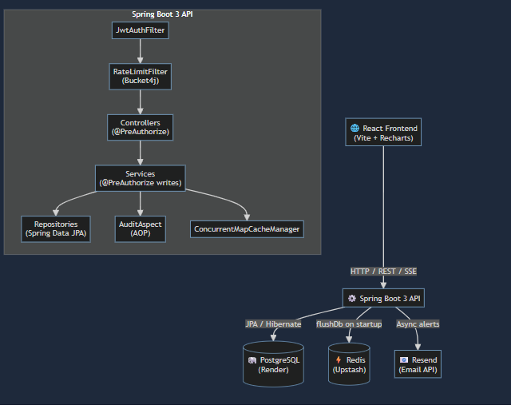
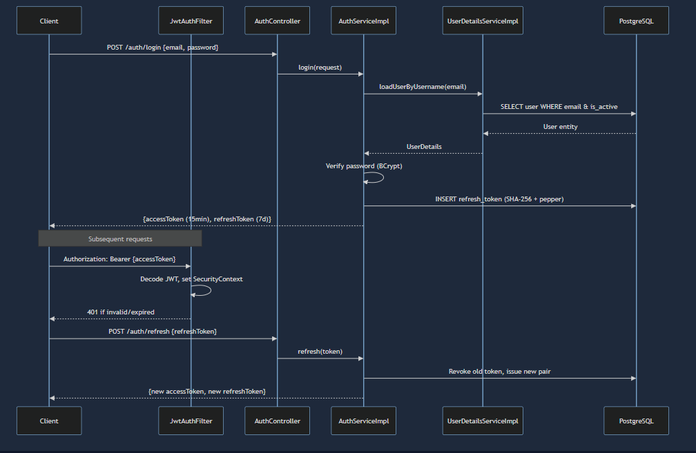

# Zorvyn Finance Backend

A production-grade Spring Boot 3 backend for a finance dashboard system with role-based access control, JWT authentication with refresh token rotation, in-memory caching, audit logging via AOP, anomaly detection, rate limiting, spending forecasts, budget envelopes, merchant intelligence, velocity scoring, DNA fingerprinting, CSV/Excel/PDF export, bulk import, and email alerts via Resend.

---

## Live Deployment

| Service | URL |
|---|---|
| Frontend | https://zorvyn-frontend-53m1.onrender.com/login |
| Backend API | https://zorvyn-backend-tyi6.onrender.com |
| Swagger UI | https://zorvyn-backend-tyi6.onrender.com/swagger-ui/index.html |

### Default Login Credentials

| Email | Password | Role |
|---|---|---|
| `admin@finance.com` | `admin123` | ADMIN |
| `analyst@finance.com` | `analyst123` | ANALYST |
| `viewer@finance.com` | `viewer123` | VIEWER |

> **Note:** The free Render tier spins down after 15 minutes of inactivity. The first request after a cold start may take 30–60 seconds.

---

## 1. Architecture Overview




## 2. Tech Stack

| Layer | Technology | Why |
|---|---|---|
| Framework | Spring Boot 3.2 + Spring Security 6 | Industry standard, mature ecosystem |
| Database | PostgreSQL 16 via Spring Data JPA + Hibernate 6 | ACID compliance, production-proven |
| Migrations | Flyway (4 versioned migrations) | Versioned schema changes tracked in source control |
| Cache | In-memory (`ConcurrentMapCacheManager`) | Zero serialization issues; Redis connection kept for flush-on-startup |
| Auth | JWT (JJWT 0.12) + Refresh Token Rotation | Stateless auth with replay attack prevention |
| API Docs | SpringDoc OpenAPI 3 (Swagger UI) | Auto-generated from code |
| Export | Apache POI (Excel) + OpenCSV + iText 8 | Industry-standard libraries |
| Email | Resend Java SDK | Simple HTTP API, no SMTP config needed |
| Rate Limiting | Bucket4j | Token bucket algorithm, role-aware limits |
| Build | Maven | Stable, widely supported in CI/CD |
| Deployment | Docker + Render + Upstash Redis | Reproducible environments |

---

## 3. Cloud Deployment Guide

### Infrastructure

| Service | Provider | Plan |
|---|---|---|
| Backend (Spring Boot) | Render | Free (Docker) |
| Frontend (React/Vite) | Render | Free (Docker) |
| PostgreSQL | Render | Free managed Postgres |
| Redis | Upstash | Free (TLS, 256MB) |

### Environment Variables — `zorvyn-backend`

| Key | Required | Value |
|---|---|---|
| `JWT_SECRET` | Yes | `openssl rand -base64 32` — no surrounding quotes |
| `JWT_REFRESH_TOKEN_PEPPER` | Yes | `openssl rand -base64 32` — no surrounding quotes |
| `SPRING_DATASOURCE_URL` | Yes | `jdbc:postgresql://<host>/<db>` — must include `jdbc:` prefix |
| `SPRING_DATASOURCE_USERNAME` | Yes | Postgres username |
| `SPRING_DATASOURCE_PASSWORD` | Yes | Postgres password |
| `SPRING_DATA_REDIS_URL` | Yes | `rediss://default:<password>@<host>.upstash.io:6379` |
| `SPRING_DATA_REDIS_SSL` | Yes | `true` |
| `FRONTEND_URL` | Yes | `https://zorvyn-frontend-<slug>.onrender.com` |
| `RESEND_API_KEY` | No | From [resend.com](https://resend.com) — email alerts disabled if blank |
| `ALERT_EMAIL_FROM` | No | `onboarding@resend.dev` or your verified domain |
| `ALERT_HIGH_VALUE_THRESHOLD` | No | INR threshold for high-value alerts (default `10000`) |

> **Important:** Do NOT wrap `JWT_SECRET` or `JWT_REFRESH_TOKEN_PEPPER` in quotes in the Render dashboard. The values are base64-decoded automatically.

### Environment Variables — `zorvyn-frontend`

| Key | Value |
|---|---|
| `VITE_API_URL` | `https://zorvyn-backend-<slug>.onrender.com` |

> After setting `VITE_API_URL`, trigger a **Manual Deploy** on the frontend — Vite bakes this value in at build time.

### Database Reset (clean slate)

```bash
PGPASSWORD=<password> psql -h <external-host> -U <user> <dbname> -c \
  "DROP SCHEMA public CASCADE; CREATE SCHEMA public;"
```

Then trigger a **Manual Deploy** on `zorvyn-backend`. Flyway re-runs all 4 migrations automatically.

---

## 4. How the Application Works

### 4.1 Authentication Flow

`POST /api/v1/auth/login`:
1. `AuthController` delegates to `AuthServiceImpl`
2. Spring's `AuthenticationManager` calls `UserDetailsServiceImpl`, which loads the user from PostgreSQL and checks `is_active`
3. Access token (JWT, 15 min TTL) and refresh token (UUID, 7 day TTL) are issued
4. Refresh token is SHA-256 hashed with a pepper and stored in `refresh_tokens` — never plaintext
5. On `POST /auth/refresh`, old token is revoked and a new pair issued (rotation prevents replay attacks)

Every request passes through `JwtAuthFilter`:
- Extracts Bearer token from `Authorization` header (or `?token=` query param for SSE)
- JWT secret is base64-decoded automatically, with quote-stripping for env var safety
- Sets `SecurityContext` so `@PreAuthorize` works downstream

### 4.2 Role-Based Access Control

Three roles: `VIEWER`, `ANALYST`, `ADMIN`.

- Role checks enforced at **controller layer** via `@PreAuthorize` for read endpoints
- Write operations additionally secured at **service layer** via `@PreAuthorize`
- Filter chain uses `.anyRequest().authenticated()` — no role rules in the filter chain to avoid conflicts

| Action | Minimum Role |
|---|---|
| Read transactions, dashboard, export, forecast, merchants, budgets | VIEWER |
| Create, update transactions, bulk import | ANALYST |
| Delete, restore, manage users, budgets, categories | ADMIN |

### 4.3 Transaction Lifecycle

`POST /api/v1/transactions`:
1. Idempotency check — duplicate `Idempotency-Key` returns original response
2. Transaction saved to PostgreSQL
3. Anomaly detection — amount > 3σ from category average adds `X-Anomaly-Warning` header
4. Off-hours detection — transactions between 1am–5am set `offHours: true`
5. DNA fingerprinting — SHA-256 hash of `(userId | amount | categoryId | 4-hour bucket)` flags duplicates within 5 minutes
6. Velocity scoring — EMA score (0–100) comparing today's spend to 7-day rolling average
7. Merchant tagging — notes scanned for known merchant keywords
8. SSE broadcast — new transaction pushed to all connected clients
9. Email alerts — anomaly and high-value alerts sent via Resend (async, skipped if `RESEND_API_KEY` not set)
10. Audit log — `AuditAspect` asynchronously writes an `AuditLog` record

### 4.4 Dashboard

`GET /api/v1/dashboard/summary` returns total income, expenses, net balance, category breakdown, and 10 recent transactions. All read methods use `@Transactional(readOnly=true)` to keep the Hibernate session open for lazy-loaded associations (`open-in-view: false`).

### 4.5 Caching

In-memory `ConcurrentMapCacheManager` is used instead of Redis serialization to eliminate `ClassCastException` and `LazyInitializationException` issues that occur when complex DTOs are serialized to/from Redis JSON. Redis connection is still used to flush stale entries on startup via `DataInitializer`.

### 4.6 Budget Envelopes

Admins set monthly spending limits per category via `POST /api/v1/budgets`. `BudgetService.getStatus()` calculates actual spend, percentage used, projected end-of-month spend, and flags envelopes over 80%.

### 4.7 Spending Forecast

`GET /api/v1/forecast?days=30` uses exponential smoothing (α=0.3) on the last 30 days of daily expense data per category.

### 4.8 Merchant Intelligence

`GET /api/v1/merchants/top?period=monthly` aggregates `MerchantTag` records to return top merchants by total spend.

### 4.9 Velocity Scoring

On every transaction creation, `VelocityService` computes a velocity score (0–100) using EMA (α=0.4). Admins view full risk profiles via `GET /api/v1/users/{id}/risk-profile`.

### 4.10 Rate Limiting

`RateLimitFilter` uses Bucket4j's token bucket algorithm with per-user in-memory buckets:

| Role | Limit |
|---|---|
| VIEWER | 100 requests/minute |
| ANALYST | 200 requests/minute |
| ADMIN | 500 requests/minute |

### 4.11 Transaction Simulator

`TransactionSimulator` fires every **60 seconds** and creates a realistic random transaction for a random active user, exercising the full transaction pipeline.

### 4.12 Bulk Import

`POST /api/v1/transactions/import/csv` and `/import/json` accept multipart file uploads. All rows validated and saved in a single `@Transactional` boundary — any error rolls back the entire import.

### 4.13 PDF Export

`GET /api/v1/transactions/export?format=pdf&from=2025-01-01&to=2025-06-30` generates a financial statement PDF using iText 8.

### 4.14 Email Alerts via Resend

Anomaly and high-value transaction alerts are sent via the [Resend](https://resend.com) Java SDK. Alerts are `@Async` and silently skipped when `RESEND_API_KEY` is not configured — no startup failure.

---

## 5. Local Setup

### Option A — Docker (recommended)

```bash
cd "path/to/Zorvyn_Backend_Assessment_Anagha_Badhe"

cp .env.example .env
# Edit .env: set JWT_SECRET and JWT_REFRESH_TOKEN_PEPPER
# Generate: openssl rand -base64 32

docker-compose up --build
```

API: `http://localhost:8080` | Swagger: `http://localhost:8080/swagger-ui.html`

### Option B — Local (PostgreSQL + Redis already running)

Prerequisites: PostgreSQL 16 on port 5432 (`financedb` / `postgres` / `postgres`), Redis on port 6379.

```bash
docker-compose up postgres redis
mvn spring-boot:run
```

### Frontend

```bash
cd frontend && npm install && npm run dev
```

Frontend: `http://localhost:3000`

### Environment Variables

| Key | Required | Description |
|---|---|---|
| `JWT_SECRET` | Yes | Base64 string ≥ 32 bytes — `openssl rand -base64 32` |
| `JWT_REFRESH_TOKEN_PEPPER` | Yes | Base64 string ≥ 32 bytes — `openssl rand -base64 32` |
| `SPRING_DATA_REDIS_URL` | Yes | Redis connection URL |
| `FRONTEND_URL` | Yes | CORS allowed origin |
| `RESEND_API_KEY` | No | Email alerts disabled if blank |
| `ALERT_EMAIL_FROM` | No | Sender address (use `onboarding@resend.dev` for testing) |
| `ALERT_HIGH_VALUE_THRESHOLD` | No | INR threshold (default `10000`) |

### Clean slate

```bash
docker-compose down -v && docker-compose up --build
```

---

## 6. API Reference

Swagger UI: `https://zorvyn-backend-tyi6.onrender.com/swagger-ui/index.html`

### Authentication — `/api/v1/auth`
| Method | Endpoint | Auth | Description |
|---|---|---|---|
| POST | `/register` | Public | Register (gets VIEWER role) |
| POST | `/login` | Public | Returns access + refresh tokens |
| POST | `/refresh` | Public | Rotate refresh token |
| POST | `/logout` | Public | Revoke refresh token |
| GET | `/me` | Any role | Current user profile + roles |

### Transactions — `/api/v1/transactions`
| Method | Endpoint | Role | Description |
|---|---|---|---|
| GET | `/` | VIEWER+ | List with filters + pagination |
| GET | `/{id}` | VIEWER+ | Get by ID |
| POST | `/` | ANALYST+ | Create (supports `Idempotency-Key` header) |
| PUT | `/{id}` | ANALYST+ | Update |
| DELETE | `/{id}` | ADMIN | Soft delete |
| GET | `/deleted` | ADMIN | Recycle bin |
| POST | `/{id}/restore` | ADMIN | Restore |
| GET | `/{id}/history` | VIEWER+ | Audit history |
| GET | `/stream` | Any | Live SSE feed (token via `?token=` query param) |
| GET | `/export?format=csv` | VIEWER+ | Export CSV |
| GET | `/export?format=excel` | VIEWER+ | Export Excel |
| GET | `/export?format=pdf&from=2025-01-01&to=2025-06-30` | VIEWER+ | Export PDF |
| POST | `/import/csv` | ANALYST+ | Bulk import CSV |
| POST | `/import/json` | ANALYST+ | Bulk import JSON |

### Categories — `/api/v1/categories`
| Method | Endpoint | Role | Description |
|---|---|---|---|
| GET | `/` | VIEWER+ | List all |
| POST | `/` | ADMIN | Create |
| PUT | `/{id}` | ADMIN | Update |
| DELETE | `/{id}` | ADMIN | Delete |

### Dashboard — `/api/v1/dashboard`
| Method | Endpoint | Role | Description |
|---|---|---|---|
| GET | `/summary` | VIEWER+ | Income, expenses, net balance, category breakdown |
| GET | `/trends` | VIEWER+ | Month-by-month totals for past 12 months |

### Users — `/api/v1/users`
| Method | Endpoint | Role | Description |
|---|---|---|---|
| GET | `/` | ADMIN | List all users |
| GET | `/{id}` | ADMIN | Get by ID |
| PUT | `/{id}` | ADMIN | Update name, status, or roles |
| DELETE | `/{id}` | ADMIN | Deactivate user |
| GET | `/{id}/risk-profile` | ADMIN | Velocity score, 24h/7d spend, risk level |

### Budget Envelopes — `/api/v1/budgets`
| Method | Endpoint | Role | Description |
|---|---|---|---|
| POST | `/` | ADMIN | Create or update monthly budget limit |
| GET | `/status?monthYear=2025-06` | VIEWER+ | Real-time spend vs limit |

### Spending Forecast — `/api/v1/forecast`
| Method | Endpoint | Role | Description |
|---|---|---|---|
| GET | `/?days=30` | VIEWER+ | Projected spend per category |

### Merchant Intelligence — `/api/v1/merchants`
| Method | Endpoint | Role | Description |
|---|---|---|---|
| GET | `/top?period=monthly` | VIEWER+ | Top merchants by spend |

### Response Headers on Transaction Creation
| Header | Meaning |
|---|---|
| `X-Anomaly-Warning: true` | Amount > 3σ from category average |
| `X-Anomaly-Detail` | Human-readable explanation |
| `X-Velocity-Score` | Spend velocity score 0–100 |
| `X-RateLimit-Remaining` | Remaining requests in current window |

---

## 7. Running Tests

```bash
mvn test
```

| Test class | Type | What it covers |
|---|---|---|
| `AuthServiceTest` | Unit (Mockito) | Register, login, duplicate email rejection |
| `TransactionServiceTest` | Unit (Mockito) | Create, idempotency, soft delete, restore |
| `TransactionControllerTest` | Integration (MockMvc) | HTTP layer, role enforcement |
| `TransactionRepositoryTest` | Integration (Testcontainers) | Real PostgreSQL queries |
| `AuthRefreshIntegrationTest` | Integration (Testcontainers) | Refresh token rotation, logout revocation |

---

## 8. Project Structure

```
src/main/java/com/financeapi/
├── config/       ← SecurityConfig, RedisConfig, MailConfig, OpenApiConfig,
│                   RateLimitFilter, DataInitializer, DataSourceConfig,
│                   TransactionSimulator
├── domain/       ← JPA entities: User, Role, Transaction, Category,
│                   RefreshToken, AuditLog, Budget, TransactionDna, MerchantTag
├── repository/   ← Spring Data JPA repositories
├── service/      ← Service interfaces + implementations
│   └── impl/     ← AuthServiceImpl, TransactionServiceImpl, DashboardServiceImpl,
│                   CategoryServiceImpl, BudgetService, ForecastService,
│                   MerchantService, VelocityService, DnaFingerprintService,
│                   PdfExportService, EmailAlertService (Resend), BulkImportService,
│                   SseEmitterRegistry
├── controller/   ← AuthController, TransactionController, BulkImportController,
│                   CategoryController, DashboardController, UserController,
│                   BudgetController, ForecastController, MerchantController
├── dto/          ← Request/Response DTOs
├── security/     ← JwtUtils (base64-aware), JwtAuthFilter, UserDetailsServiceImpl
├── exception/    ← Custom exceptions + GlobalExceptionHandler
├── audit/        ← AuditAspect (AOP)
└── util/         ← TransactionSpecification

src/main/resources/db/migration/
├── V1__init_schema.sql          ← Schema + seed categories + admin user
├── V2__novelty_features.sql     ← DNA, budgets, merchant tags, velocity
├── V3__seed_default_users.sql   ← Analyst and viewer seed users
└── V4__fix_users_and_roles.sql  ← Fix password hashes + role assignments

frontend/          ← Vite + React frontend (Zorvyn theme)
render.yaml        ← Render Blueprint
docker-compose.yml ← Local development stack
.env.example       ← Environment variable template
```

---

## 9. Technical Decisions & Trade-offs

### Framework — Spring Boot 3 + Java 17
Strict type safety catches errors at compile time. Spring's ecosystem provides Security, Data JPA, Cache, and AOP out of the box. The layered Controller → Service → Repository architecture keeps concerns separated.

### Database — PostgreSQL with Flyway
Finance data is relational. ACID compliance and constraint enforcement. Flyway ensures schema state is always reproducible across 4 versioned migrations. `open-in-view: false` is set to prevent lazy-loading anti-patterns — all read service methods use `@Transactional(readOnly=true)` explicitly.

### Security — JWT with Refresh Token Rotation
Stateless JWT (15-minute access tokens) with refresh token rotation. SHA-256 hashed tokens with a pepper stored in `refresh_tokens`. RBAC enforced at controller layer via `@PreAuthorize` for reads, and additionally at service layer for writes. JWT secret is base64-decoded automatically with quote-stripping for env var safety.

### Caching — In-Memory instead of Redis
`ConcurrentMapCacheManager` is used for application caches instead of Redis serialization. Redis with `activateDefaultTyping` caused persistent `ClassCastException` when deserializing complex DTOs (`List<TransactionResponse>`, `Map<String, BigDecimal>`) — a class of bugs that cannot be reliably fixed without removing Redis caching entirely. The Redis connection is retained solely for `flushDb()` on startup to clear any stale entries.

### Email — Resend SDK
Replaced `spring-boot-starter-mail` (SMTP) with the Resend Java SDK. SMTP configuration caused startup failures when credentials were absent. Resend uses a simple HTTP API — the `EmailAlertService` is gracefully disabled when `RESEND_API_KEY` is not set, with no impact on startup or transaction creation.

### Data Processing
Dashboard aggregations pushed down to JPQL queries. Complex logic (anomaly detection, velocity scoring, forecasts, DNA fingerprinting) lives in the Java service layer where it is unit-testable. `TransactionSpecification` uses explicit `JoinType.LEFT` only when category filtering/search is needed, and sets `query.distinct(true)` only on data queries (not count queries) to avoid Hibernate 6's `SemanticException`.

---

## 10. Known Limitations

- **Rate limit state is in-memory** — breaks under horizontal scaling; production fix is Bucket4j's `RedisProxyManager`
- **Single currency** — all amounts assumed to be INR
- **Dashboard computed on-the-fly** — for millions of records, a materialized view would be needed
- **Merchant classification is a static dictionary** — production would use a merchant classification API
- **No email verification** — registered users are immediately active
- **Render free tier cold starts** — services spin down after 15 minutes; first request takes 30–60 seconds
- **Search is JPQL `LIKE`** — sufficient for this scale; Elasticsearch would be needed for production

---

## 11. Future Improvements

- **Redis-backed rate limiting** via Bucket4j `RedisProxyManager` for horizontal scale
- **OAuth2/OIDC** (Keycloak or Cognito) for federated identity
- **Materialized views** for dashboard aggregations at scale
- **Multi-currency support** with real-time exchange rates
- **Email verification** on registration
